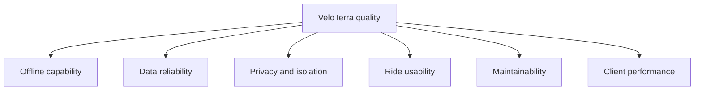

# 12.1 Quality Requirements Overview

Documentation Hints

Prioritize quality attributes and link them to concrete, testable scenarios.

| ID | Attribute | Priority | Evidence / Mechanism |
|---|---|---:|---|
| Q-01 | Offline capability | 1 | PWA precache, CacheFirst basemap, explicit region download. |
| Q-02 | Data reliability | 1 | IndexedDB/localStorage persistence and optional monotonic sync. |
| Q-03 | Privacy | 1 | Local-by-default operation and user-scoped cloud RLS. |
| Q-04 | Ride usability | 2 | GPS status, large controls, wake lock, live map/HUD. |
| Q-05 | Maintainability | 2 | TypeScript, focused modules, centralized economy constants, ADRs. |
| Q-06 | Client performance | 2 | Viewport-filtered fog input, geometry revision signal, download pool. |