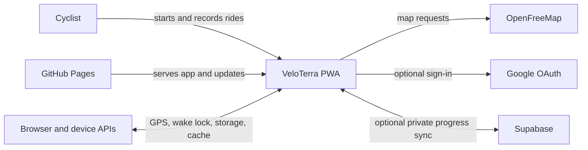

# 4.1 Business Context

Documentation Hints

Show the system boundary, users, neighboring systems, and exchanged information.

| Neighbor | Information Exchanged |
|---|---|
| Cyclist | Ride commands, settings, map interaction; ride status, progress, history, and wallet. |
| Browser/device APIs | Position fixes, wake-lock lifecycle, IndexedDB records, local preferences, service-worker caches. |
| OpenFreeMap | Style JSON, vector/raster tiles, glyphs, and sprites. |
| Google OAuth | User authentication through Supabase-managed OAuth flow. |
| Supabase | Auth session plus private explored-cell, wallet, and ride records. |
| GitHub Pages | Versioned static application assets and PWA updates. |