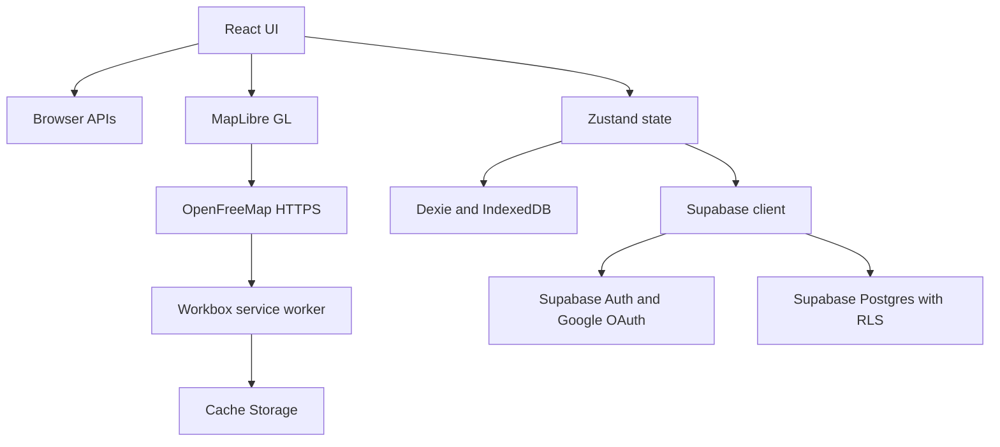

# 4.2 Technical Context

Documentation Hints

Describe protocols, data formats, and technical interfaces across the system boundary.

| Interface | Protocol / API | Data |
|---|---|---|
| Browser geolocation | W3C Geolocation API, `watchPosition` | Longitude, latitude, accuracy, speed, heading, timestamp. |
| Screen wake control | Screen Wake Lock API | Wake-lock request and release lifecycle. |
| Local structured data | IndexedDB through Dexie | Cells, rides, and offline-region metadata. |
| Local preferences/counters | Web Storage through Zustand persistence | Map style and wallet counters. |
| Offline assets | Cache Storage through Workbox service worker | App shell, styles, tiles, glyphs, sprites, worker modules. |
| Basemap | HTTPS | OpenFreeMap JSON, PBF vector tiles, PNG raster tiles, glyphs, sprites. |
| Authentication | HTTPS OAuth 2.0 / Supabase Auth | Google identity, browser session, refresh token. |
| Cloud persistence | HTTPS Supabase PostgREST | JSON rows for explored cells, wallet counters, and rides. |
| Deployment | GitHub Actions and GitHub Pages over HTTPS | Static `dist` artifact. |

