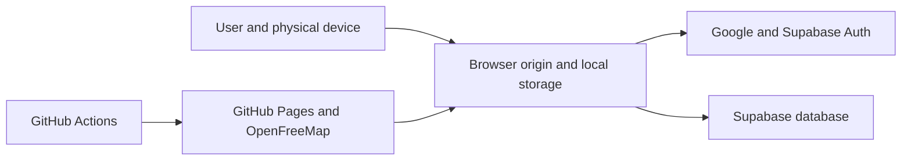

# 4.3 Trust Zones

Documentation Hints

Identify trust boundaries and ownership of controls. Detailed controls belong in Section 10.

| Zone | Trust Assumption | Primary Controls |
|---|---|---|
| Device and browser profile | Controlled by the user; may be lost, compromised, or cleared. | Browser sandbox, HTTPS origin, device access controls. |
| Public web assets | Public and mutable only through repository deployment. | Git review, Actions permissions, Pages HTTPS. |
| Browser-to-cloud boundary | Client input is untrusted. | Authenticated session, TLS, RLS, user-scoped keys. |
| Supabase | Managed external service containing optional private progress. | RLS, schema constraints, provider controls. |
| CI/CD | Trusted to publish application artifacts. | Repository permissions and encrypted Actions secrets. |