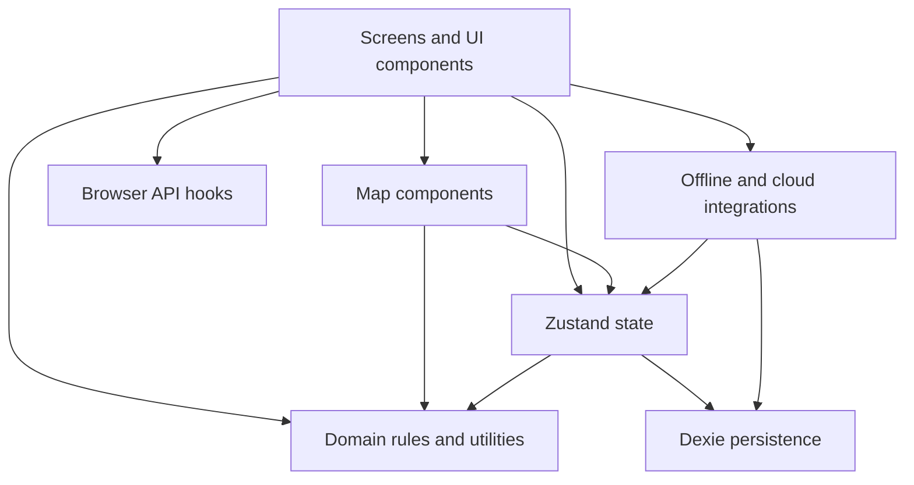

# 6.1 Whitebox: Overall System

Documentation Hints

Describe the static decomposition, responsibilities, and dependencies of the overall system.

| Building Block | Location | Responsibility |
|---|---|---|
| Application shell | `src/app`, `src/main.tsx` | Router, startup, auth initialization, visibility-triggered sync, MapLibre worker setup. |
| Screens | `src/screens` | User workflows for menu, ride, history, summary, wallet, settings, and offline maps. |
| Shared UI | `src/components` | Reusable account, currency, and subpage presentation. |
| Map components | `src/map` | Live map, historical route map, style selection, marker, and fog layers. |
| State | `src/state` | Auth, explored cells, wallet counters, and preferences. |
| Domain | `src/domain`, selected `src/lib` utilities | Economy constants, currency conversion, geographic calculations, and fog geometry. |
| Persistence | `src/data`, `src/lib/rides.ts`, `src/lib/regions.ts` | IndexedDB schema and CRUD operations. |
| Integrations | `src/lib/offline.ts`, `src/lib/sync.ts`, `src/lib/supabase.ts` | Tile prefetch, service-worker interaction, cloud client, and reconciliation. |
| Browser adapters | `src/hooks` | Geolocation and Wake Lock lifecycle. |

## Dependency Rules

- UI orchestrates workflows and calls state/integration APIs.
- Map components read explored state but do not persist ride records.
- Economy constants are centralized and independent of React.
- IndexedDB access is concentrated in state and persistence/integration modules.
- Supabase access is isolated from map and domain geometry code.