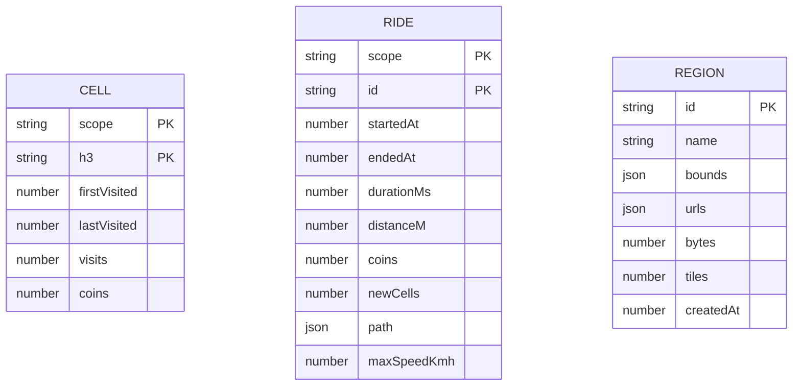

# 6.2 Persistence and Integration

Documentation Hints

Refine architecture-significant building blocks and their interfaces.

## Local Persistence

| Store | Technology | Data |
|---|---|---|
| `veloterra-local` IndexedDB | Dexie schema version 5 | Account-scoped H3 cells and completed rides, device-wide offline-region metadata, pending team contributions, and migration metadata. |
| `veloterra` IndexedDB | Legacy source, retained | Read-only migration source for ambiguous pre-account progress; rows are copied to the `unassigned` scope and are not deleted automatically. |
| `veloterra-wallet` | Zustand persisted in localStorage | Wallet snapshots keyed by local scope; lifetime earnings, cloud-authoritative spending, derived balance, total distance, and ride count. |
| `veloterra-prefs` | Zustand persisted in localStorage | Selected map style. |
| Workbox caches | Cache Storage | App shell and OpenFreeMap assets. |

The IndexedDB tables have no foreign keys. Ride statistics and cell rewards are denormalized snapshots.

Authenticated local progress uses the Supabase user ID as its scope. Signed-out
progress uses `unassigned`; it is never uploaded automatically. Legacy rows are
copied to `unassigned` during startup migration. A user must explicitly claim
that progress before it is merged into an account.

## Cloud Persistence

| Resource | Identity | Merge Rule |
|---|---|---|
| `explored` | One row per `user_id` | Union of normalized H3 identifiers. |
| `wallet` | One row per `user_id` | Maximum lifetime earnings and counters; spending changes only through an atomic RPC. |
| `rides` | `id`, scoped by `user_id` | Union by ride ID. |
| `landmarks` | Canonical Wikidata or OSM identity | Shared catalog with a versioned classification price and global restoration total. |
| `landmark_contributions` | UUID plus user idempotency key | Immutable contribution ledger. |
| `profiles` | One row per `user_id` | Public-in-game contributor name and avatar for authenticated users. |
| `teams` and membership relations | Team/user IDs with PostgreSQL RLS | Private team lifecycle, roles, invitations, recommendations, and audit history. |
| `team_explored_cells` | Team, H3 cell, active contributor | Tile-only shared exploration; removed members' contributions are cleaned up. |
| `team_live_presence` | Team and user IDs | Expiring current position only; no route history. |

The Supabase schema, RLS policies, and transaction functions are versioned in `supabase/migrations`. Team data is a separate authorization domain from personal rides, explored cells, wallet data, and rewards. On-demand OSM discovery runs in an authenticated Supabase Edge Function and writes through its service-role client. Browser clients can read shared restoration data but cannot mutate totals or contribution rows directly.