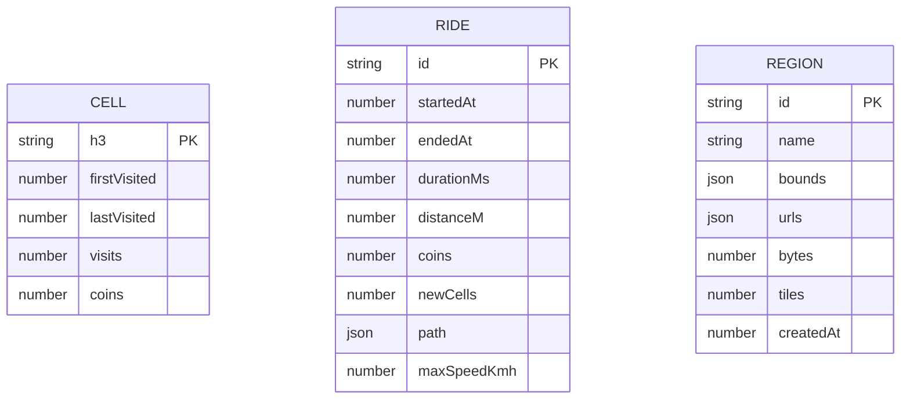

# 6.2 Persistence and Integration

Documentation Hints

Refine architecture-significant building blocks and their interfaces.

## Local Persistence

| Store | Technology | Data |
|---|---|---|
| `veloterra` IndexedDB | Dexie schema version 3 | H3 cells, completed rides, offline-region metadata. |
| `veloterra-wallet` | Zustand persisted in localStorage | Balance, total distance, ride count. |
| `veloterra-prefs` | Zustand persisted in localStorage | Selected map style. |
| Workbox caches | Cache Storage | App shell and OpenFreeMap assets. |

The IndexedDB tables have no foreign keys. Ride statistics and cell rewards are denormalized snapshots.

## Cloud Persistence

| Resource | Identity | Merge Rule |
|---|---|---|
| `explored` | One row per `user_id` | Union of normalized H3 identifiers. |
| `wallet` | One row per `user_id` | Maximum of each accumulating counter. |
| `rides` | `id`, scoped by `user_id` | Union by ride ID. |

The cloud schema and RLS policies are external operational dependencies. Their migrations are not currently versioned in this repository.