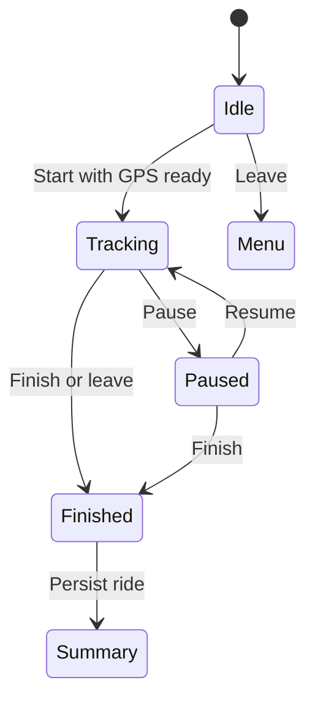

# 7.1 Ride Lifecycle

Documentation Hints

Describe an important runtime scenario, including state changes and exceptional behavior.

- The Ride screen starts geolocation immediately so the user can obtain a fix and inspect the map before starting.
- Production Start remains disabled until geolocation status is `tracking`.
- Vite development mode supplies simulated fixes and map-click movement.
- Wake Lock is requested whenever the phase is not idle.
- Pausing stops time, distance, reveal, and rewards but leaves geolocation active.
- Resuming clears the previous point so the paused gap is not counted.
- Finishing persists a ride and opens its summary; signed-in non-simulated rides trigger sync.