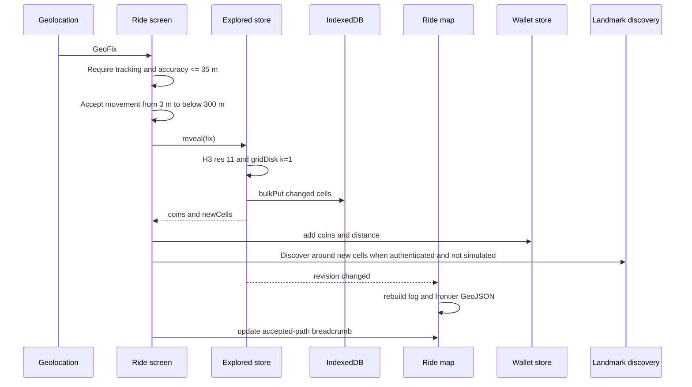

# 7.2 Reveal and Reward

Documentation Hints

Describe the dynamic interaction for exploration and reward processing.

New cells award 10 copper each. A known cell awards 1 copper only when its last visit is more than six hours old. New-cell changes increment the geometry revision; revisit-only updates do not alter fog geometry. Authenticated production rides also request landmark discovery once per coarse area when new cells are revealed; simulated development fixes never populate the global catalog. Categories prone to minor local features require a Wikidata, Wikipedia, or Wikimedia Commons reference before admission. The ride map renders accepted movement as a teal-to-gold progress line. The standalone exploration overview keeps the basemap behind fog at every zoom and renders the explored-area heatmap above it at low zoom. At neighborhood zoom, exact explored H3 cells reveal the basemap and receive the same frontier treatment as the ride map.