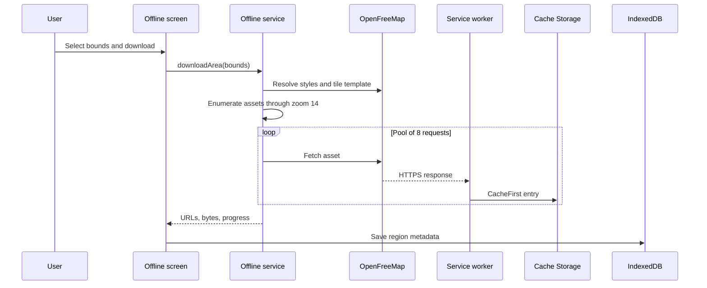

# 7.3 Offline Map Download

Documentation Hints

Describe the successful and failure paths of offline preparation.

- The estimated download is rejected above 100 MB.
- All configured styles, relevant glyph ranges, sprites, low-zoom raster, and vector tiles are prefetched.
- Missing nonessential tiles are skipped; cancellation propagates through `AbortSignal`.
- The flow requires an active service worker and therefore cannot complete under `npm run dev`.
- Region deletion uses stored URL references so assets shared with another region remain cached.