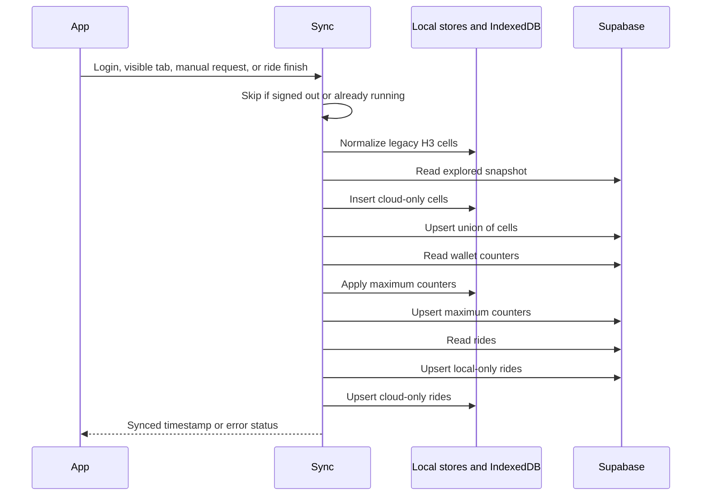

# 7.4 Cloud Synchronization

Documentation Hints

Describe synchronization triggers, ordering, merge semantics, and error handling.

The merge is monotonic: union and maximum operations avoid destructive conflict resolution. This also means incorrect or simulated local progress cannot be automatically subtracted after synchronization.