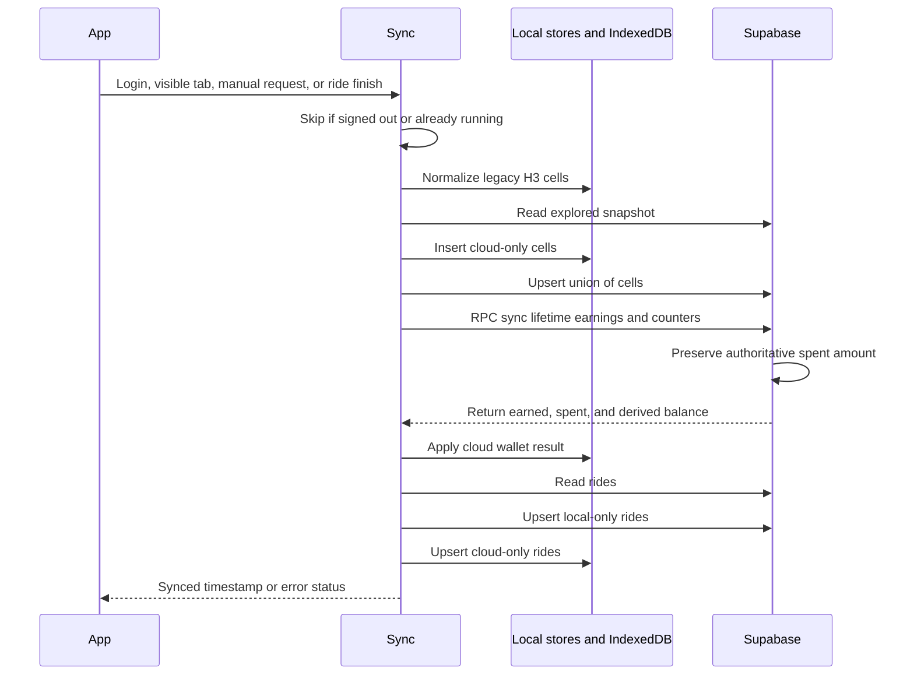
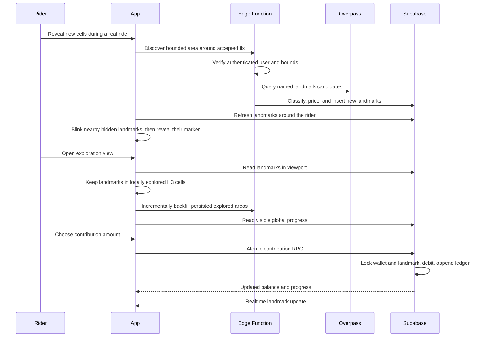

# 7.4 Cloud Synchronization

Documentation Hints

Describe synchronization triggers, ordering, merge semantics, and error handling.

Exploration and ride merging remain monotonic. Wallet earnings merge monotonically, while spending is recorded only by server-side transactions and is therefore not overwritten by an offline device.

## Team Contributions and Presence

- After explicit invitation consent, the client places existing and newly explored H3
    cells into the Dexie team outbox. A successful insert is idempotent; the outbox row
    is deleted only after the server accepts it.
- Team synchronization reads only the selected team's active-member contributions and
    retains the last synchronized map while offline. A confirmed membership error evicts
    the team cache and its pending outbox rows.
- Live position uses a separate RPC. The client sends only while the ride is tracking
    and the rider has opted in for the selected team. The server applies a five-second
    update limit and a 90-second expiry. Finish, pause, sign-out, leave, removal, and
    membership loss clear the current presence.

## Landmark Restoration

