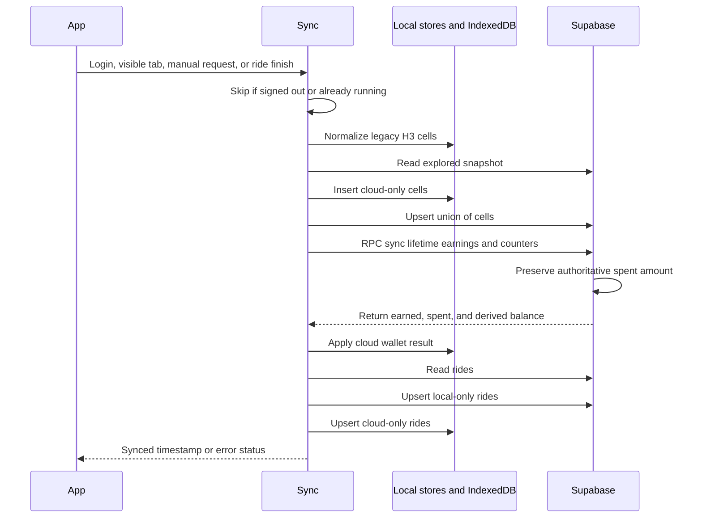
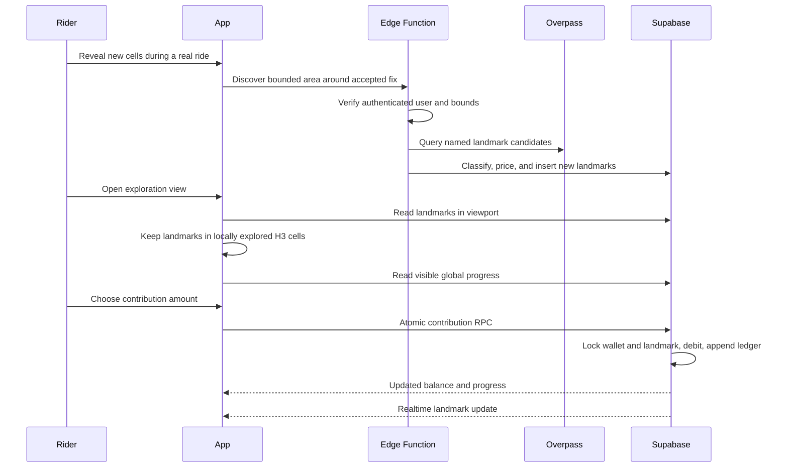

# 7.4 Cloud Synchronization

Documentation Hints

Describe synchronization triggers, ordering, merge semantics, and error handling.

Exploration and ride merging remain monotonic. Wallet earnings merge monotonically, while spending is recorded only by server-side transactions and is therefore not overwritten by an offline device.

## Landmark Restoration

