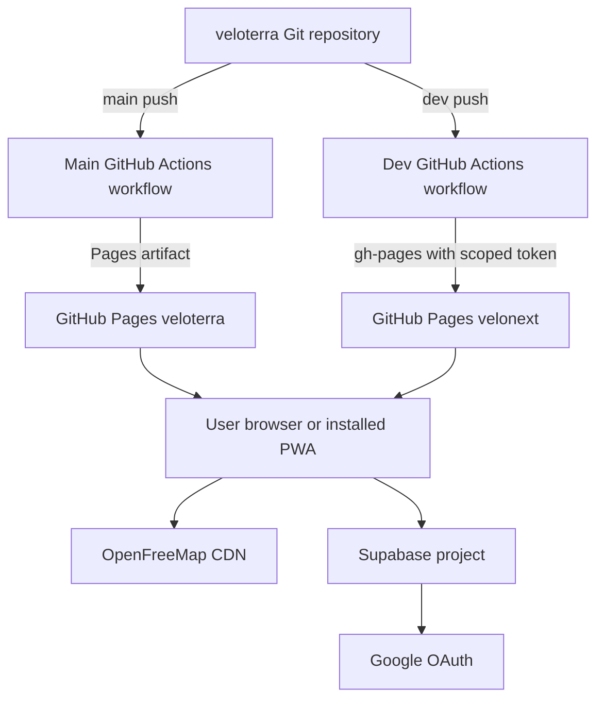

# 8.1 Infrastructure

Documentation Hints

Describe deployment nodes, environments, artifacts, and the mapping from software to infrastructure.

## Environments

| Environment | Source | Base Path | Destination | Purpose |
|---|---|---|---|---|
| Local development | Working tree | `/velonext/` by default | Vite server | Hot reload, automatic simulated GPS, no service worker. |
| Local preview | Built `dist` | Build-time value | Vite preview | Production artifact and service-worker checks. |
| Development | `dev` branch | `/velonext/` | `madcowdevelopment.github.io/velonext` | Shared in-progress build. |
| Production | `main` branch | `/veloterra/` | `madcowdevelopment.github.io/veloterra` | Public application. |

## Artifact and Runtime Mapping

- GitHub-hosted Ubuntu runner uses Node 22, `npm ci`, and `npm run build`.
- The artifact contains the SPA, `404.html` route fallback, PWA assets, service worker, and MapLibre worker modules.
- The browser executes all application and domain logic.
- OpenFreeMap and Supabase remain runtime network dependencies when their online capabilities are used.
- The development deployment requires the `VELONEXT_DEPLOY_TOKEN` Actions secret for the external repository.